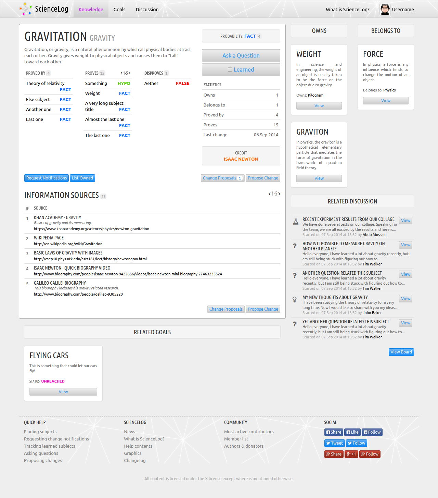

# Intro

Ever got impressed by the most mind-blowing ideas of theoretical physics?

The time of lab experiments in physics is rather gone, because nowadays our fantasy about how the universe works in micro and macro scales goes beyond our practical ability to test and verify stuff. How do researchers know they are right about their ideas? It's all about logic.

What we are doing in science is trying to *reconstruct* the laws of the universe (the system) in our heads using Boolean algebra. We are trying to put rules on top of each other and try to verify whether they are `true` or `false`. What an analogy to software development?

With growing set of rules our *reconstruction* of the universe (the system) gets bigger and our heads are not big enough to compare all established `true` rules with new ideas. And so happens that we have 2 different theories largely backed by many `true` rules, but they don't make sense with each other together in certain parts, like the quantum physics and the theory of relativity.

Fortunately, we have these wonderful things called computers that can do stuff for us. We can build a massive database of rules and have a machine comparing all established `true` rules with rules coming from new ideas and verify them this way. I am confident about building an experiment system for verifying massively complex theoretical sciences like physics. Imagine it like **unit testing of science**.

Once such a system is built, which can store *rules of theories* in both human and machine readable way, it can not only serve the mankind in verifying new and existing theories, it may also... try to generate new theories automatically.

I know I can't do this on my own. I would like to invite you to think with me about such an experiment practically and attempt to create a real project.

Let's start by thinking [what could the data structure look like](https://github.com/Codename-METASYS/theory/issues/1).

We can also chat on [Gitter](https://gitter.im/Codename-METASYS/Lobby)!

# Q/A

### What features should the platform include?

- Structured information about *subjects* and *rules* between them.
- The ability to change the existing of information by the community/users (proposals).
- Automatic verification of proposals with established rules.
- The ability to add, delete or change information sources for each subject.
- The ability to check whether the user acknowledged selected subject (learned it).
- The ability to discuss new ideas or topics and ask questions (maybe integration with StackExchange?).
- Notification of changes about a given subject if the user opts in.
- Goals of science (maybe?).

### What will this project help with?

- Oragnisation of knowledge.
- Verification of existing theories.
- Learning, with related subjects you won't miss anything as well as with many community-verified information sources you won't have to search the internet by trial and error.
- Staying up to date with theories you are interested about.
- Having a place where to seriously discuss scientific questions and ideas with the widest community.
- Access to the latest scientific information and research results for everyone with internet connection (not just for university students).
- Automatic generating of new theories (?).

### How will this be different from Wikipedia or similar websites?

Wikipedia does not:
- programatically verify theories,
- allow you to mark learned subjects (articles),
- offer discussions / forums dedicated to subjects.

This platform is not supposed to be a source of information, instead it will be a *sign post* to existing information sources. No articles here.

### What fields of knowledge should the platform cover?

Perhaps natural sciences. Should we start with just theoretical physics and see?

### Why is there *ScienceLog* on the preview image?

Original idea for a name of the platform from when the preview UI was built back in 2014.
